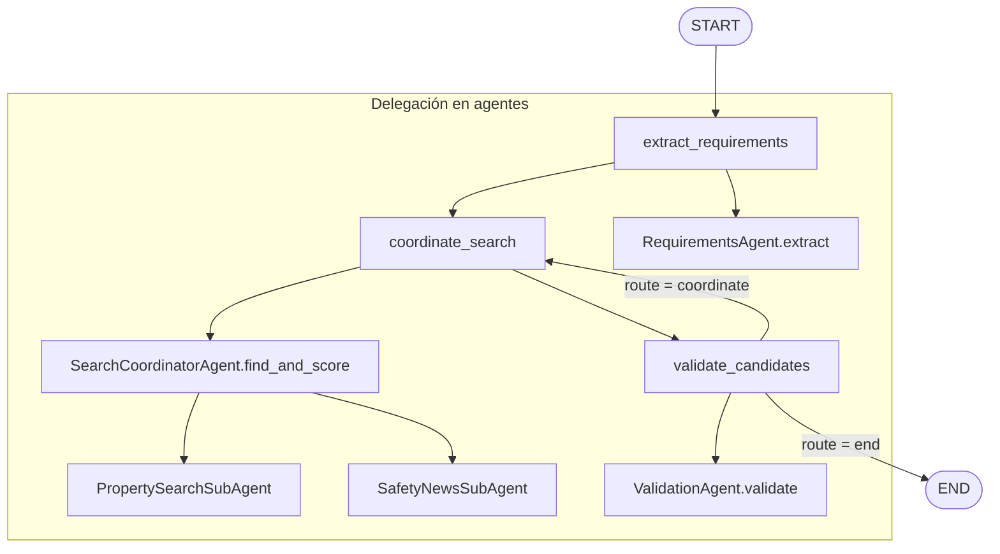

# Real Estate Referrer — Documentación del proyecto

Sistema multi-agente en Python que convierte texto libre del usuario en un ranking
puntuado de propiedades, validando la seguridad percibida del entorno con
noticias públicas. Especificación de referencia: `agente-constructor.md`.

---

## 1. Descripción de la arquitectura del sistema

**Real Estate Referrer** es un sistema multi-agente orquestado con **LangGraph**.
La fachada `RealEstateReferrerApp.run(prompt)` compila e invoca un `StateGraph`
con tres nodos y un bucle condicional de flexibilización.

### Capas principales

| Capa | Responsabilidad |
|------|-----------------|
| **Fachada** (`app.py` — `RealEstateReferrerApp`) | Punto de entrada único: `run(prompt)` → grafo LangGraph → `FinalResponse`. |
| **Orquestación** (`graph/`) | `StateGraph`: nodos, aristas y routing condicional. |
| **Agentes** (`agents/`) | Lógica de dominio: extracción, coordinación, validación y sub-agentes. |
| **Modelos** (`models/`) | Contratos Pydantic v2 entre pasos (sin diccionarios sueltos en fronteras). |
| **Conectores** (`connectors/`) | Fuentes externas: Metrocuadrado, DuckDuckGo News, fixtures. |
| **Scoring** (`scoring.py`) | Cálculo determinístico de `match_score` y `final_score`. |
| **Config** (`config.py`) | `SearchConfig`, pesos, umbrales, relajación, modos de conector. |

### Flujo lógico (tres agentes + dos sub-agentes)

1. **RequirementsAgent** — texto libre → `UserPropertyRequirements`.
2. **SearchCoordinatorAgent** — orquesta:
   - `PropertySearchSubAgent` (listados vía conectores).
   - `SafetyNewsSubAgent` (noticias / riesgo por zona).
   - Fusiona y calcula `final_score = w_match · match_score + w_safety · safety_score`.
3. **ValidationAgent** — aprueba o rechaza candidatos; si no hay aprobados, relaja
   criterios y reintenta hasta `max_rounds`.

### Proveedor LLM

- Protocolo `LLMClient` (`agents/llm_client.py`).
- Implementaciones: `RuleBasedStubLLMClient` (regex, default en tests/CI),
  `LangChainStructuredLLMClient` (`LLM_PROVIDER=openai`), mocks en tests.
- Fábrica `create_llm_client()` según entorno o `--llm-provider`.

### Modos de conectores

`SearchConfig.connector_mode`:

- `real` — scraping HTTP (Metrocuadrado, DuckDuckGo News).
- `fixtures` — JSON/HTML locales en `tests/fixtures/`.
- `hybrid` (default) — intenta real y degrada a fixtures si falla.

---

## 2. Definición del estado

El estado compartido del grafo es `ReferrerState` (`graph/state.py`):

```python
class ReferrerState(TypedDict):
    user_prompt: str
    config: SearchConfig
    requirements: UserPropertyRequirements | None
    scored: list[ScoredProperty]
    approved: list[ScoredProperty]
    round_index: int
    rounds_used: int
    route: GraphRoute  # Literal["end", "coordinate"]
    log: Annotated[list[str], operator.add]
```

### Semántica de cada campo

| Campo | Rol |
|-------|-----|
| `user_prompt` | Texto original del usuario (inmutable durante la ejecución). |
| `config` | `SearchConfig`: umbrales, rondas máximas, pesos, conectores, relajación. |
| `requirements` | Esquema normalizado; se **actualiza** tras una ronda de relajación. |
| `scored` | Candidatos puntuados (`ScoredProperty`) de la última búsqueda coordinada. |
| `approved` | Ranking final tras validación (vacío si no hubo aprobados). |
| `round_index` | Índice de ronda actual (0-based); usado por la política de flexibilización. |
| `rounds_used` | Número de rondas ejecutadas; alimenta `FinalResponse.rounds`. |
| `route` | `"end"` o `"coordinate"` — decisión de la arista condicional post-validación. |
| `log` | Trazas acumulativas del pipeline (`operator.add` en LangGraph). |

### Estado inicial

`initial_state(user_prompt, config)` inicializa:

- `requirements = None`
- `scored = []`, `approved = []`
- `round_index = 0`, `rounds_used = 0`
- `route = "end"`
- `log = []`

### Salida al consumidor

`FinalResponse` (`models/response.py`):

- `requirements: UserPropertyRequirements`
- `ranking: list[ScoredProperty]`
- `rounds: int` (≥ 1)
- `log: list[str]`

### Modelo de dominio central

`UserPropertyRequirements` (`models/requirements.py`) incluye:

- `raw_user_prompt`, `property_type`, `operation`
- Rangos: `area_sqm`, `price`, `floors`, `parking_spots`, `bedrooms`, `bathrooms`
- `currency`, `location` (`LocationHint`), `desired_safety_level`
- `layout_notes`, `layout_flags`
- `defaults_applied`, `flexibility_notes`

---

## 3. Diagrama del grafo propuesto

### Diagrama Mermaid



### Representación ASCII

```
START → extract_requirements → coordinate_search → validate_candidates
                                      ↑                    |
                                      |         (approved) ├──→ END
                                      └── (relax) ─────────┘
                                           hasta max_rounds
```

### Implementación (`graph/builder.py`)

- `START` → `extract_requirements`
- `extract_requirements` → `coordinate_search`
- `coordinate_search` → `validate_candidates`
- Arista condicional desde `validate_candidates`:
  - `route == "end"` → `END`
  - `route == "coordinate"` → `coordinate_search`

Función de routing: `route_after_validate(state) → state["route"]`.

---

## 4. Descripción de las actividades y su implementación

### Nodo 1: `extract_requirements`

| Aspecto | Detalle |
|---------|---------|
| **Actividad** | Normalizar el prompt del usuario a `UserPropertyRequirements`. |
| **Agente** | `RequirementsAgent` |
| **Método** | `extract(user_text, config)` |
| **Mecanismo** | LLM con salida estructurada (schema JSON Pydantic) + `SearchConfig.apply_defaults()`. |
| **Prompt** | `prompts/01_requirements_agent.md` |
| **Archivos** | `agents/requirements_agent.py`, `agents/llm_client.py` |

### Nodo 2: `coordinate_search`

| Aspecto | Detalle |
|---------|---------|
| **Actividad** | Buscar propiedades, evaluar seguridad por zona, puntuar y ordenar. |
| **Agente** | `SearchCoordinatorAgent` |
| **Método** | `find_and_score(requirements, log=...)` |

**Sub-actividades:**

1. **Búsqueda de propiedades** — `PropertySearchSubAgent.search()`:
   - Conectores: `MetrocuadradoConnector`, `FixturesPropertyConnector`.
   - Respeta `max_candidates` de `SearchConfig`.

2. **Evaluación de seguridad** — `SafetyNewsSubAgent.assess_area()`:
   - Una evaluación por `location.key()` única entre candidatos.
   - Conectores: `DuckDuckGoNewsConnector`, `FixturesNewsConnector`.
   - Ventana temporal: `news_window_days` (default 90).

3. **Scoring** — `compute_final_score()` en `scoring.py`:
   - `match_score`: penalizaciones por precio, área, habitaciones, baños,
     parqueaderos, pisos, tipo de inmueble y operación.
   - `final_score = weights.match × match_score + weights.safety × safety_score`
     (default 0.7 / 0.3).

| **Archivos** | `agents/search_coordinator.py`, `agents/property_search_subagent.py`, `agents/safety_news_subagent.py`, `scoring.py`, `connectors/` |

### Nodo 3: `validate_candidates`

| Aspecto | Detalle |
|---------|---------|
| **Actividad** | Deduplicar, filtrar por umbrales, decidir fin o relajación. |
| **Agente** | `ValidationAgent` |
| **Método** | `validate(candidates, requirements, round_index=...)` |

**Criterios de rechazo:**

- Duplicado (misma URL o mismo título + precio).
- `final_score < min_final_score` (default 0.55).
- Precio > `price.max × 1.10` (tolerancia del 10 %).
- `source_url` vacía.

**Routing** (en `graph/nodes.py`):

- Si hay aprobados → `route = "end"`, llena `approved`.
- Si no hay aprobados y hay `relaxed_requirements` → `route = "coordinate"`,
  actualiza `requirements`, incrementa `round_index`.
- Si no hay más relajaciones posibles → `route = "end"` con ranking vacío.

| **Archivos** | `agents/validation_agent.py`, `graph/nodes.py` |

### Patrón de nodos

Cada nodo es una **factory** (`make_extract_node`, `make_coordinate_node`,
`make_validate_node`) que devuelve una función `(state) → dict` con actualizaciones
parciales del estado LangGraph.

---

## 5. Estrategia de relajación de condiciones

La relajación es **determinística** (no depende del LLM). Se aplica solo cuando:

- No hay candidatos aprobados en la ronda actual, **y**
- `round_index < max_rounds - 1`.

Implementación: `ValidationAgent._relax()` en `agents/validation_agent.py`.

### Reglas de relajación (orden de aplicación)

| Campo | Acción | Parámetro (`SearchConfig`) | Default |
|-------|--------|----------------------------|---------|
| `price.max` | Incrementa el techo en un porcentaje | `relax_price_pct` | +15 % |
| `area_sqm.min` | Reduce el área mínima en un porcentaje | `relax_area_pct` | −15 % |
| `location.landmarks` | Añade barrios vecinos según mapa fijo | `NEIGHBORHOOD_NEIGHBORS` | Ver tabla abajo |
| `desired_safety_level` | Si era `high` y no hubo otras relajaciones, baja a `medium` | — | Caso especial |

### Mapa de barrios vecinos (Medellín / Bogotá)

```python
NEIGHBORHOOD_NEIGHBORS = {
    "laureles": ["Estadio", "Belén", "La América"],
    "el poblado": ["Envigado", "Sabaneta"],
    "envigado": ["El Poblado", "Sabaneta"],
    "belén": ["Laureles", "La América"],
    "robledo": ["La América", "San Javier"],
    "estadio": ["Laureles", "Belén"],
    "chapinero": ["Usaquén", "Teusaquillo"],
    "usaquén": ["Chapinero"],
}
```

### Trazabilidad

Cada relajación genera un registro `RelaxationApplied` (campo, valor antes/después,
`rationale`). El nuevo `UserPropertyRequirements` actualiza `flexibility_notes` con
el resumen de campos relajados.

### Límite de rondas

- `max_rounds` en `SearchConfig` (default **2**, rango 1–5 en CLI `--max-rounds`).
- Tras agotar rondas sin aprobados, el grafo termina con `ranking` vacío y log de
  rechazos.

### Campos que **no** se relajan automáticamente

Habitaciones, baños, parqueaderos, tipo de inmueble u operación permanecen fijos;
solo se amplían precio, área mínima, landmarks y (en un caso) nivel de seguridad.

---

## 6. Ejemplo de ejecución

### Por CLI

```bash
python -m real_estate_referrer \
  "Apto en arriendo en Laureles 2 hab hasta 1.500.000" \
  --mode fixtures --show-log
```

Opciones relevantes:

- `--mode {real,fixtures,hybrid}` — fuente de datos.
- `--max-rounds N` — tope del bucle de flexibilización (1–5).
- `--llm-provider {stub,openai}` — proveedor LLM.
- `--show-log` — imprime el log estructurado del pipeline.

### Secuencia esperada (fixtures + stub LLM)

1. **Entrada:** prompt en español sobre apartamento en arriendo en Laureles.
2. **extract_requirements:** el LLM/stub produce `UserPropertyRequirements`
   (ciudad Medellín, barrio Laureles, `bedrooms.min = 2`, `price.max = 1_500_000`, …)
   y aplica defaults documentados en `defaults_applied`.
3. **coordinate_search (ronda 1):** conectores fixtures devuelven candidatos;
   scoring calcula `match_score` y `safety_score`; orden por `final_score` descendente.
4. **validate_candidates:** candidatos con `final_score ≥ 0.55` y precio dentro de
   tolerancia pasan a `approved` → `route = "end"`.
5. **Salida:** `FinalResponse` con ranking, requisitos finales, `rounds` y `log`.

### Ejemplo con relajación (dos rondas)

Si en la ronda 1 todos los candidatos quedan bajo `min_final_score`:

1. `validate_candidates` aplica relajaciones (precio +15 %, área −15 %, barrios vecinos).
2. `coordinate_search` (ronda 2) busca de nuevo con requisitos ampliados.
3. Si hay aprobados → fin con ranking; si no → fin con ranking vacío y log de rechazos.

### Por API (Python)

```python
from real_estate_referrer import RealEstateReferrerApp, SearchConfig

app = RealEstateReferrerApp(config=SearchConfig(connector_mode="fixtures"))
response = app.run("Apto en arriendo en Laureles 2 hab hasta 1.500.000")

for scored in response.ranking:
    print(scored.final_score, scored.candidate.title)
    print(scored.reasoning)
```

### Referencia en tests

El test `test_graph_invoke_returns_ranking_for_typical_prompt` en
`tests/test_graph.py` ejecuta un flujo end-to-end con el prompt de Laureles y
verifica que `response.ranking` no esté vacío.

---

## 7. Reflexión crítica

### Fortalezas

- **Separación de responsabilidades:** LangGraph orquesta; la lógica de dominio vive
  en clases de agente reutilizables y testeables.
- **Trazabilidad:** `log`, `reasoning` por candidato, `ScoreBreakdown`,
  `RelaxationApplied` y rechazos estructurados (`RejectedProperty`).
- **Degradación controlada:** conectores reales caen a fixtures ante errores HTTP o
  de parsing (`ConnectorError`).
- **Cobertura de pruebas:** modelos, scoring, flexibilización, grafo, conectores
  (mocks HTTP), integración CLI y fábrica LLM.
- **Flexibilización auditable:** reglas determinísticas, no opacas al LLM.

### Limitaciones y riesgos

| Riesgo | Descripción |
|--------|-------------|
| Scraping frágil | Metrocuadrado y DuckDuckGo pueden responder 403 o cambiar selectores HTML. |
| Stub LLM limitado | Regex en español; cobertura reducida frente a prompts atípicos. |
| Mapa de barrios cerrado | Zonas fuera de `NEIGHBORHOOD_NEIGHBORS` no amplían ubicación automáticamente. |
| Seguridad heurística | Basada en noticias públicas, no en estadísticas oficiales de criminalidad. |
| Relajación parcial | No flexibiliza habitaciones, baños ni tipo de inmueble. |
| Mercado implícito | Defaults en Medellín / COP; generalizar exige nuevos conectores y vecindarios. |

### Mejoras posibles

- Persistencia de estado y feedback del usuario entre sesiones.
- Relajación asistida por LLM con límites explícitos encima de las reglas actuales.
- APIs estables de portales inmobiliarios en lugar de scraping.
- Métricas de calidad del ranking (p. ej. precision@k con datos etiquetados).
- Ampliar fuentes de noticias y señales de seguridad (datos abiertos municipales).

---

## Estructura del repositorio

```
src/real_estate_referrer/
  models/        # Pydantic — UserPropertyRequirements, PropertyCandidate, ...
  agents/        # LLMClient, LangChain, 5 agentes concretos
  graph/         # StateGraph LangGraph (state, nodes, builder)
  connectors/    # Metrocuadrado, DuckDuckGo News, fixtures
  prompts/       # 5 archivos versionados
  config.py      # SearchConfig + defaults
  scoring.py     # match_score, safety_score, final_score
  app.py         # RealEstateReferrerApp + CLI
tests/
  fixtures/      # JSON / HTML reproducibles
```

## Referencias

- `README.md` — instalación, uso y variables de entorno.
- `agente-constructor.md` — especificación funcional completa.
- `.env.example` — configuración de `LLM_PROVIDER`, `OPENAI_API_KEY`, etc.
