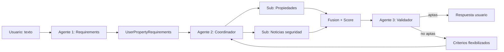

# Agente constructor — Real Estate Referrer (modo plan)

Este documento es la **única fuente de verdad** para un agente de desarrollo (“super agente constructor”) que debe diseñar e implementar el software en Python. El constructor debe operar primero en **modo plan**: leer este archivo completo, producir un plan de pasos verificables y obtener confirmación (explícita o implícita según el flujo del equipo) **antes** de escribir código de producción.

**Nombre del proyecto:** Real Estate Referrer (según `lineamientos.md`).

---

## 1. Objetivo del producto

Construir un sistema **basado en agentes** que:

1. Reciba como entrada un **texto libre del usuario** (string tipo prompt).
2. Normalice ese texto a un **esquema estándar** de preferencias y restricciones de compra/arriendo de propiedad.
3. Busque y evalúe propiedades candidatas que cumplan criterios (propios del usuario o **por defecto**).
4. Valide **seguridad percibida del entorno** mediante información de noticias u otras fuentes públicas cercanas a la ubicación.
5. Devuelva al usuario un **ranking** de propiedades con **score** y justificación breve.

Los criterios pueden ser **configurados por el usuario** (por ejemplo en un objeto de configuración o texto adicional) o tomarse de **valores por defecto** documentados en código.

---

## 2. Principios de diseño obligatorios

### 2.1 Orientación a clases (API interna)

- Toda la orquestación debe exponerse como **clases concretas** con métodos claros.
- **No** se debe “invocar agentes sueltos” desde el punto de entrada principal; se llaman **métodos de servicios/clases** que por dentro ejecutan al agente (LLM + herramientas).
- Los datos que circulan entre pasos deben ser **instancias de dataclasses / modelos Pydantic / clases tipadas** — no diccionarios sueltos en la frontera entre agentes.

### 2.2 Trazabilidad

- Cada propiedad candidata debe llevar: fuente, URL o referencia, extracción estructurada, scores parciales y score final.
- Cada decisión de “no apta / solicitar nueva búsqueda con criterios flexibles” debe quedar registrada en una estructura de resultado (log estructurado o campo `reasoning`).

### 2.3 Modo plan del constructor

Antes de implementar, el constructor debe:

1. Enumerar **módulos y archivos** a crear.
2. Enumerar **dependencias** (ej. SDK del proveedor LLM, HTTP, scraping si aplica).
3. Definir **interfaces** (firmas de métodos públicos de cada clase).
4. Listar **riesgos** (sitios con anti-bot, costo de tokens, alucinaciones en URLs).
5. Proponer **orden de implementación** y **pruebas** mínimas.

Solo después de eso pasa a codificación.

---

## 3. Arquitectura lógica del sistema

### 3.1 Pipeline de tres agentes principales

| Orden | Agente (rol) | Responsabilidad |
|-------|----------------|-----------------|
| 1 | **Extractor / normalizador** | Texto usuario → `UserPropertyRequirements` (esquema estándar). |
| 2 | **Coordinador de búsqueda** | Orquesta dos sub-agentes: búsqueda de propiedades y búsqueda de noticia/seguridad; fusiona resultados y calcula **score**. |
| 3 | **Validador / gatekeeper** | Aprueba o rechaza candidatos para mostrar al usuario; si rechaza, solicita **nueva pasada** al agente 2 con **criterios más flexibles**. |

### 3.2 Sub-agentes del agente 2

1. **Buscador de propiedades:** encuentra listados que cumplan requisitos en **páginas web y/o redes sociales** (definir interfaces de “conectores” por fuente).
2. **Buscador de noticias / seguridad:** obtiene señales de seguridad del barrio/zona cercana a cada candidato (noticias recientes, categorización de riesgo).

### 3.3 Diagrama de flujo (referencia)



---

## 4. Modelo de datos (clases obligatorias)

El constructor debe implementar un paquete `models` (nombre puede variar, pero la semántica no) con al menos lo siguiente.

### 4.1 Requisitos del usuario — campos obligatorios

Estructura estándar que el agente 1 debe poblar (valores pueden ser opcionales / rangos / enums según diseño, pero **deben existir estos conceptos**):

| Concepto en dominio | Representación sugerida |
|---------------------|-------------------------|
| Área | `area_sqm_min`, `area_sqm_max` o rango único |
| Precio | moneda + `price_min`, `price_max` o presupuesto objetivo |
| Ubicación | ciudad, zona/barrio, coordenadas aproximadas si existen |
| Seguridad del barrio | peso o nivel deseado (`desired_safety_level`) |
| Distribución del espacio | texto estructurado + flags (ej. cocina abierta, estudio) |
| Número de pisos | entero o rango |
| Parqueaderos | entero o rango |
| Habitaciones | entero o rango |
| Baños | entero o rango |

Incluir además:

- `raw_user_prompt: str` (verbatim o resumen controlado).
- `defaults_applied: list[str]` — qué campos se rellenaron por defecto.
- `flexibility_notes: Optional[str]` — espacio para el agente 3 para pedir relajación explícita.

### 4.2 Propiedad candidata

Campos mínimos:

- Identificador interno, título, descripción corta.
- Precio, área, tipo (casa, apto, etc.).
- Ubicación normalizada + URL de origen.
- Atributos: pisos, parqueaderos, habitaciones, baños.
- `requirements_match_score: float` (0–1 o 0–100 — documentar escala).
- `safety_score: float` y referencias a noticias analizadas.
- `final_score: float` y `score_breakdown: dict` o modelo tipado.

### 4.3 Resultado de validación (agente 3)

- `approved_properties: list[PropertyCandidate]`
- `rejected_properties: list` con motivo estructurado.
- `relaxed_requirements: Optional[UserPropertyRequirements]` — versión flexibilizada para reintentar con agente 2.

---

## 5. Clases de servicio (invocación “como métodos”)

El constructor debe implementar servicios con interfaces similares a estas (firmas exactas ajustables, pero la separación de responsabilidades **no**):

```python
# Pseudointerfaces — el constructor debe materializar en módulos reales.

class RequirementsAgent:
    def extract(self, user_text: str, config: SearchConfig) -> UserPropertyRequirements: ...

class PropertySearchSubAgent:
    def search(self, requirements: UserPropertyRequirements) -> list[PropertyCandidate]: ...

class SafetyNewsSubAgent:
    def assess_area(self, location: LocationHint, context: UserPropertyRequirements) -> SafetyAssessment: ...

class SearchCoordinatorAgent:
    def find_and_score(self, requirements: UserPropertyRequirements) -> list[ScoredProperty]: ...

class ValidationAgent:
    def validate(
        self,
        candidates: list[ScoredProperty],
        requirements: UserPropertyRequirements,
    ) -> ValidationResult: ...

class RealEstateReferrerApp:
    """Fachada única para el usuario / CLI / API."""
    def run(self, user_prompt: str, config: SearchConfig | None = None) -> FinalResponse: ...
```

**Regla:** el método `RealEstateReferrerApp.run` es el único lugar “público” obligatorio para ejecutar el pipeline completo (admite tests de integración).

---

## 6. Configuración y valores por defecto

Implementar `SearchConfig` (o equivalente) con:

- Lista de **fuentes habilitadas** (conectores).
- **Defaults** para rangos cuando el usuario no especifique (documentados).
- Límites operativos: `max_candidates`, `max_rounds` de flexibilización, timeouts HTTP.
- Opción de **modo simulado** (fixtures) para desarrollo sin scraping real.

---

## 7. Política de flexibilización (agente 3 → agente 2)

Cuando no haya candidatos aptos:

1. El validador debe producir `relaxed_requirements` con cambios **explícitos y acotados**, por ejemplo:
   - aumentar `price_max` un porcentaje configurable;
   - reducir `area_sqm_min`;
   - ampliar radio de ubicación;
   - bajar umbral mínimo de `safety_score` solo si está justificado y registrado.
2. El coordinador se invoca de nuevo con los requisitos relajados.
3. Debe existir un **tope** `max_rounds` para evitar bucles infinitos.

---

## 8. Entregables del constructor (código + prompts)

### 8.1 Estructura de proyecto sugerida

```
src/real_estate_referrer/
  __init__.py
  models/
  agents/
  connectors/          # fuentes web / APIs
  prompts/               # archivos .md o .txt por agente
  config.py
  app.py
tests/
README.md                # uso básico (opcional si el curso lo exige)
```

### 8.2 Archivos de prompt por agente

El constructor debe **generar y versionar** prompts en `prompts/` (uno por rol), mínimo:

| Archivo sugerido | Rol |
|------------------|-----|
| `prompts/01_requirements_agent.md` | Agente 1 — extracción a esquema |
| `prompts/02_property_search_subagent.md` | Sub-agente propiedades |
| `prompts/03_safety_news_subagent.md` | Sub-agente noticias / seguridad |
| `prompts/04_search_coordinator.md` | Coordinador — fusión y scoring |
| `prompts/05_validation_agent.md` | Validador + reglas de flexibilización |

Cada archivo debe contener al menos:

- **Rol y objetivo**
- **Formato de salida obligatorio** (JSON schema o ejemplo inequívoco)
- **Restricciones** (no inventar URLs; si no hay datos, declarar `unknown`)
- **Ejemplos few-shot** breves (opcional pero recomendado)

---

## 9. Plantillas de prompts (contenido mínimo que deben cumplir los archivos generados)

> El constructor puede copiar/adaptar lo siguiente en los archivos de `prompts/`. Las llaves `{placeholders}` son intencionales.

### 9.1 `01_requirements_agent.md`

**System / instrucciones permanentes:**

- Eres un extractor de restricciones para búsqueda de vivienda en español.
- Convierte el mensaje del usuario en un objeto JSON que coincida con el schema `UserPropertyRequirements` definido por el proyecto.
- Si falta información, usa `null` y registra en `defaults_applied` las suposiciones solo si el proyecto define defaults explícitos en configuración; si no hay default, deja `null`.
- Incluye `location` con ciudad y barrio si se mencionan; si solo hay landmarks, guárdalos en `location.landmarks`.
- Normaliza números (habitaciones, baños, parqueaderos, pisos) como enteros o `{min,max}` según schema.
- **No** inventes precios o áreas no mencionadas.

**User template:**

```
Mensaje del usuario:
{user_text}

Configuración de defaults disponible (JSON):
{defaults_json}
```

**Salida:** JSON válido contra el schema del proyecto.

---

### 9.2 `02_property_search_subagent.md`

**System:**

- Eres un investigador que encuentra listados reales de propiedades alineados con filtros duros y blandos.
- Puedes usar herramientas de búsqueda web / conectores provistos por el runtime (el constructor debe cablear herramientas reales).
- Devuelve una lista JSON de candidatos con URL, precio, área, habitaciones, baños, parqueaderos, pisos, tipo y ubicación.
- Si una fuente no es accesible, documenta el fallo en `errors` sin inventar propiedades.

**User template:**

```
Requisitos normalizados:
{requirements_json}

Fuentes permitidas:
{sources_json}

Máximo de candidatos: {max_candidates}
```

---

### 9.3 `03_safety_news_subagent.md`

**System:**

- Eres un analista de seguridad urbana basado en **noticias públicas recientes** vinculadas a la zona de la propiedad.
- No diagnosticas culpabilidad ni haces afirmaciones legales; produces un **score de riesgo/inseguridad** y lista de referencias (título, medio, fecha, URL).
- Si no hay cobertura NOTICIOSA relevante, devuelve `confidence: low` y no penalices arbitrariamente.

**User template:**

```
Ubicación a evaluar:
{location_json}

Ventana temporal de noticias (días): {news_window_days}

Contexto del usuario (peso seguridad): {safety_weight}
```

---

### 9.4 `04_search_coordinator.md`

**System:**

- Coordinas sub-resultados: listados + evaluaciones de seguridad.
- Emparejas cada propiedad con la evaluación geográfica más cercana/relevante.
- Calculas `final_score` como combinación ponderada configurable (ej. 70% match requisitos, 30% seguridad — valores en config).
- Desempatas favoreciendo mayor seguridad y mejor match de habitaciones/baños críticos.

**User template:**

```
Requisitos:
{requirements_json}

Candidatos de propiedades:
{properties_json}

Evaluaciones de seguridad por zona:
{safety_json}

Pesos de scoring:
{weights_json}
```

---

### 9.5 `05_validation_agent.md`

**System:**

- Auditas candidatos ya puntuados antes de mostrarlos al usuario.
- Eliminas duplicados, inconsistencias (precio fuera de rango extremo vs fuente), y baja calidad de evidencia.
- Si **ninguno** es apto, generas `relaxed_requirements` con cambios mínimos y trazables (lista `relaxations_applied`).
- Respeta políticas éticas: no discriminación; seguridad basada en hechos reportados, no estereotipos.

**User template:**

```
Requisitos originales:
{requirements_json}

Candidatos puntuados:
{scored_properties_json}

Umbrales de aprobación:
{thresholds_json}

Ronda actual / máximo:
{round_index}/{max_rounds}
```

---

## 10. Scoring (criterios de negocio)

El constructor debe documentar en código la fórmula usada. Recomendación:

- `match_score`: penalización por desviación en precio, área, recursos (hab/baño/etc.).
- `safety_score`: invertir o normalizar el riesgo del sub-agente de noticias para que “mayor = mejor”.
- `final_score = w_match * match_score + w_safety * safety_score` con `w_match + w_safety = 1`.

---

## 11. Criterios de aceptación (checklist verificable)

El proyecto se considera **aceptado** cuando:

1. **Entrada salida:** Se puede ejecutar `RealEstateReferrerApp.run(prompt)` y obtener una lista ordenada de propiedades con score y explicación corta.
2. **Esquema:** El agente 1 produce `UserPropertyRequirements` con los campos obligatorios del apartado 4.1 (aunque algunos sean `null`).
3. **Coordinación:** El agente 2 invoca explícitamente (en código) al sub-agente de propiedades y al de noticias, y combina resultados.
4. **Validación y flexibilidad:** El agente 3 puede rechazar todo el lote y disparar una segunda ronda con `relaxed_requirements`, respetando `max_rounds`.
5. **Estilo de código:** Agentes invocados solo desde **métodos de clase** dedicados; sin llamadas globales sueltas desde `main`.
6. **Prompts:** Existen archivos versionados en `prompts/` para los cinco roles, coherentes con el schema JSON elegido.
7. **Pruebas:** Al menos pruebas unitarias para: parsing del JSON del agente 1 (con mocks), scoring determinístico del coordinador, y política de flexibilización (sin LLM si es posible).
8. **Seguridad operativa:** Secretos (API keys) solo por variables de entorno; `.env.example` documentado.

---

## 12. Plan de implementación obligatorio (orden sugerido para modo plan)

El constructor debe presentar este plan en la fase de revisión; la implementación debe seguir el orden salvo justificación escrita.

| Fase | Entrega |
|------|---------|
| P0 | Modelos (`UserPropertyRequirements`, `PropertyCandidate`, etc.) + validación schema |
| P1 | `SearchConfig`, defaults, carga de prompts desde archivos |
| P2 | Cliente LLM abstracto (`LLMClient` protocol) + implementación concreta |
| P3 | `RequirementsAgent.extract` |
| P4 | Conectores de búsqueda (al menos uno real y uno stub) |
| P5 | Sub-agentes 2a y 2b + `SearchCoordinatorAgent` |
| P6 | `ValidationAgent` + loop de flexibilización |
| P7 | `RealEstateReferrerApp` + CLI mínima |
| P8 | Tests + README de ejecución |

---

## 13. Riesgos y mitigaciones

| Riesgo | Mitigación |
|--------|------------|
| Sitios bloquean scraping | Conectores opcionales, modo stub, APIs oficiales cuando existan |
| Alucinación de URLs | Validación de formato URL + opción de descartar sin HEAD OK |
| Costo LLM | Límites de tokens, resumen de noticias, cache por zona |
| Sesgos en “seguridad” | Prompt explícito basado en hechos citados; baja confianza sin fuentes |

---

## 14. Glosario breve

- **Agente:** Componente impulsado por LLM (y herramientas) con un rol único.
- **Modo plan:** Fase donde solo se diseña y revisa el plan; no se mergea código sin cumplir checklist de la sección 11.
- **Flexibilización:** Ajuste controlado de requisitos para una nueva búsqueda.

---

## 15. Instrucción final para el agente constructor

Al leer este documento:

1. Confirma comprensión enumerando **artefactos** y **dependencias**.
2. Propón el **schema JSON exacto** (o Pydantic) que usarás para cada agente.
3. Espera validación del plan (humano o proceso definido).
4. Implementa en Python cumpliendo las secciones 5–11 y genera los archivos en `prompts/` según la sección 9.

**Fin del documento de especificación.**
